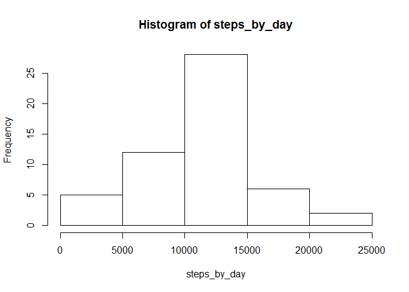
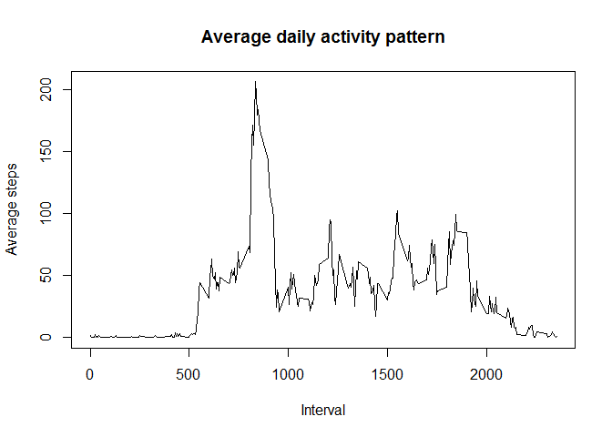
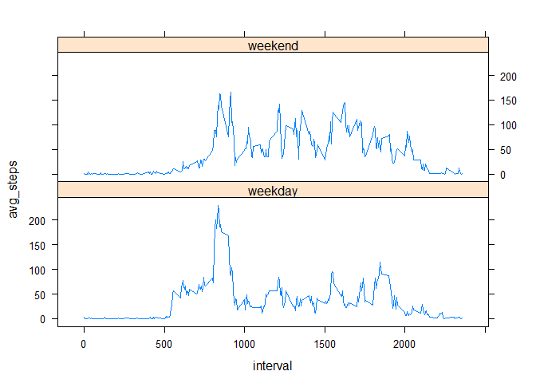

## Loading and preprocessing the data

Show any code that is needed to

1. Load the data (i.e. \color{red}{\verb|read.csv()|}read.csv())
2. Process/transform the data (if necessary) into a format suitable for your analysis


```r
# Load data
unzip("activity.zip")
data <- read.csv("activity.csv", header = TRUE, sep=",", stringsAsFactors = FALSE)

# Convert date format
data$date <- as.Date(data$date)

# Preview data
str(data)
```

```
## 'data.frame':	17568 obs. of  3 variables:
##  $ steps   : int  NA NA NA NA NA NA NA NA NA NA ...
##  $ date    : Date, format: "2012-10-01" "2012-10-01" ...
##  $ interval: int  0 5 10 15 20 25 30 35 40 45 ...
```

```r
summary(data)
```

```
##      steps             date               interval     
##  Min.   :  0.00   Min.   :2012-10-01   Min.   :   0.0  
##  1st Qu.:  0.00   1st Qu.:2012-10-16   1st Qu.: 588.8  
##  Median :  0.00   Median :2012-10-31   Median :1177.5  
##  Mean   : 37.38   Mean   :2012-10-31   Mean   :1177.5  
##  3rd Qu.: 12.00   3rd Qu.:2012-11-15   3rd Qu.:1766.2  
##  Max.   :806.00   Max.   :2012-11-30   Max.   :2355.0  
##  NA's   :2304
```

## What is mean total number of steps taken per day?

For this part of the assignment, you can ignore the missing values in the dataset.

1. Calculate the total number of steps taken per day
2. If you do not understand the difference between a histogram and a barplot, research the difference between them. Make a histogram of the total number of steps taken each day
3. Calculate and report the mean and median of the total number of steps taken per day


```r
# Calculate the total number of steps taken per day
steps_by_day <- with(data, tapply(steps, date, sum))

# Make a histogram of the total number of steps taken each day
hist(steps_by_day)
```

<!-- -->

```r
# Calculate the mean of the total number of steps taken per day
mean(steps_by_day, na.rm = TRUE)
```

```
## [1] 10766.19
```

```r
# Calculate the median of the total number of steps taken per day
median(steps_by_day, na.rm = TRUE)
```

```
## [1] 10765
```

## What is the average daily activity pattern?

1. Make a time series plot (i.e. \color{red}{\verb|type = "l"|}type="l") of the 5-minute interval (x-axis) and the average number of steps taken, averaged across all days (y-axis)
2. Which 5-minute interval, on average across all the days in the dataset, contains the maximum number of steps?


```r
# Calculate the average number of steps taken per interval
steps_by_interval <- with(data, tapply(steps, interval, mean, na.rm = TRUE))

# Make time series plot
plot(names(steps_by_interval), steps_by_interval, type='l', main = "Average daily activity pattern", xlab = "Interval", ylab = "Average steps")
```

<!-- -->

```r
# Find interval with maximum number of average steps
steps_by_interval[which.max(steps_by_interval)]
```

```
##      835 
## 206.1698
```

## Imputing missing values

Note that there are a number of days/intervals where there are missing values (coded as \color{red}{\verb|NA|}NA). The presence of missing days may introduce bias into some calculations or summaries of the data.

1. Calculate and report the total number of missing values in the dataset (i.e. the total number of rows with \color{red}{\verb|NA|}NAs)
Devise a strategy for filling in all of the missing values in the dataset. The strategy does not need to be sophisticated. For example, you could use the mean/median for that day, or the mean for that 5-minute interval, etc.
2. Create a new dataset that is equal to the original dataset but with the missing data filled in.
3. Make a histogram of the total number of steps taken each day and Calculate and report the mean and median total number of steps taken per day. Do these values differ from the estimates from the first part of the assignment? What is the impact of imputing missing data on the estimates of the total daily number of steps?


```r
# Calculate total number of missing values
sum(is.na(data$steps))
```

```
## [1] 2304
```

```r
# Impute using mean for that 5-minute interval
imputedData <- data
imputedData[is.na(imputedData$steps),"steps"] <- steps_by_interval[as.character(imputedData[is.na(imputedData$steps),"interval"])]

# Calculate the total number of steps taken per day (using imputed data)
steps_by_day_imputed <- with(imputedData, tapply(steps, date, sum))

# Make a histogram of the total number of steps taken each day (using imputed data)
hist(steps_by_day_imputed)
```

<!-- -->

```r
# Calculate the mean of the total number of steps taken per day (using imputed data)
mean(steps_by_day_imputed, na.rm = TRUE)
```

```
## [1] 10766.19
```

```r
# Calculate the median of the total number of steps taken per day (using imputed data)
median(steps_by_day_imputed, na.rm = TRUE)
```

```
## [1] 10766.19
```
The mean and median don't differ from the first part of the assignment.
Imputing missing data increases total daily number of steps.

## Are there differences in activity patterns between weekdays and weekends?

For this part the \color{red}{\verb|weekdays()|}weekdays() function may be of some help here. Use the dataset with the filled-in missing values for this part.

1. Create a new factor variable in the dataset with two levels - "weekday" and "weekend" indicating whether a given date is a weekday or weekend day.
2. Make a panel plot containing a time series plot (i.e. \color{red}{\verb|type = "l"|}type="l") of the 5-minute interval (x-axis) and the average number of steps taken, averaged across all weekday days or weekend days (y-axis). See the README file in the GitHub repository to see an example of what this plot should look like using simulated data.


```r
# Add column to indicate weekdays and weekends
imputedData$dayType <- ifelse(weekdays(imputedData$date) %in% c("sábado","domingo"), "weekend", "weekday")
imputedData$dayType <- as.factor(imputedData$dayType)

# Load dplyr
library(dplyr)
```

```
## Warning: package 'dplyr' was built under R version 3.5.1
```

```
## 
## Attaching package: 'dplyr'
```

```
## The following objects are masked from 'package:stats':
## 
##     filter, lag
```

```
## The following objects are masked from 'package:base':
## 
##     intersect, setdiff, setequal, union
```

```r
# Calculate average steps by interval and day type
steps_by_daytype_interval  <- imputedData %>% group_by(dayType, interval) %>% summarise(avg_steps = mean(steps))

# Make panel plot
library(lattice)
xyplot(avg_steps ~ interval | dayType, data = steps_by_daytype_interval, type = 'l', layout=c(1,2))
```

<!-- -->
